# Super Chambo World - Bucket's Notes
Keep in mind a few things here - First, I'm not a great Kaizo player, so digging into something that is invictus-level is quite the challenge for me, and also I wrote all of these notes while going through the tricks the first time (or - "blind" if you will).  Everything got easier as I kept attempting through though.

**Side note** - super pumped I got the preview to Super Chambo World.  Anxious to dig into this!

## Overall Notes

 - Love the retry system with the transparent background.

## Level 1 - Platform Peril

 Some details below but I really don't have anything but good things to say.  Great level, some unique setups, and a total killer ending. The custom background is also really pretty and the palette fits right in. The indicators are also nearly perfect (see 1 near the end that was _slighty_ off). I also find it neat that all of the jumps in the level are controlled-slow-falls, which makes the whole level feel like it flows together.

 **Coin indicator on the first platform is great. That tells me this hop isn't a regrab, which I like.**
 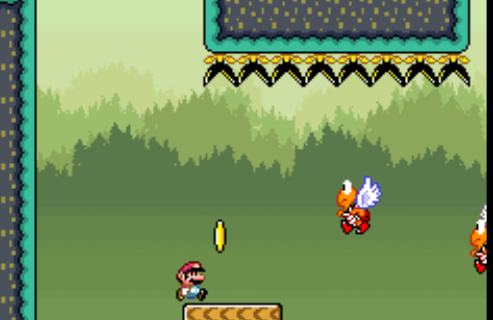

 **I feel the first Pirhana Plant trick is super tight, but I know that's what you're going for. I passed it by bouncing 6 times on the far left to avoid the flying blocks then controlling through. I'm guessing there's an easier way to predict when you need to re-hold your jump, but I couldn't find it.  I do, however, super appreciate the breathing room afterwards.  That jump is super tight and allowing the player to stop there is nice.**
 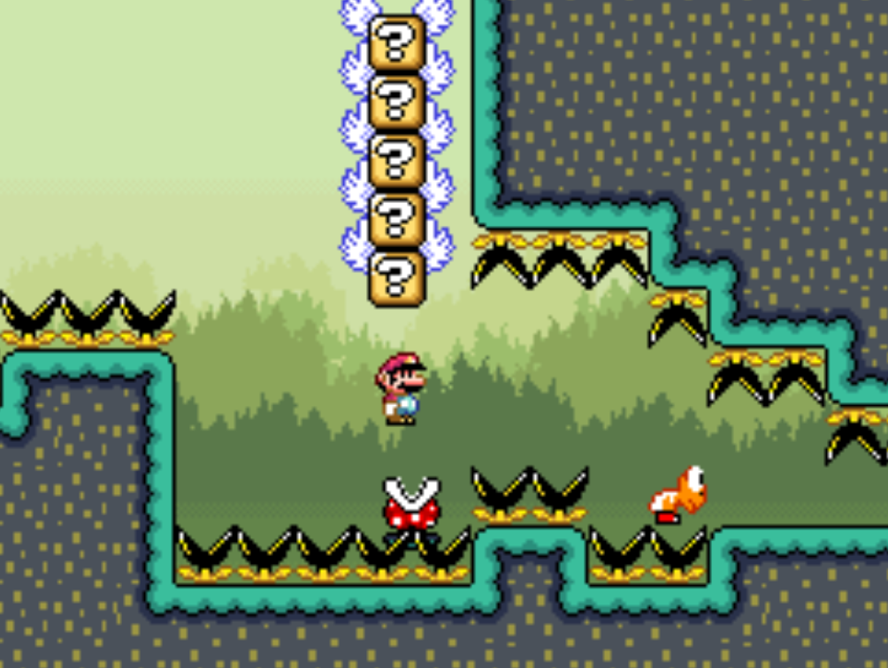

 **You need a small wait on this platform here.  There's no indicator for that and the player will just have to die to learn it. (I think)**
 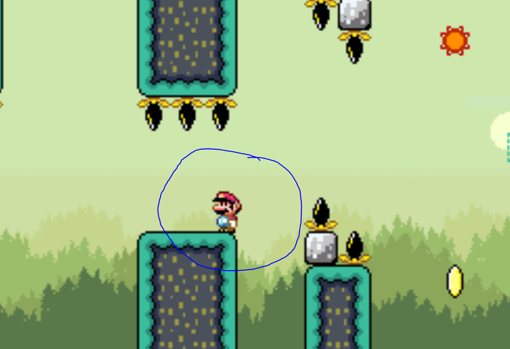

 **I really like this setup.  The position of the koopas makes me think i need to just hug the right walls, but the munchers at the top provide a nice little challenge to get over, but only took me one try to get the hang of it.**
 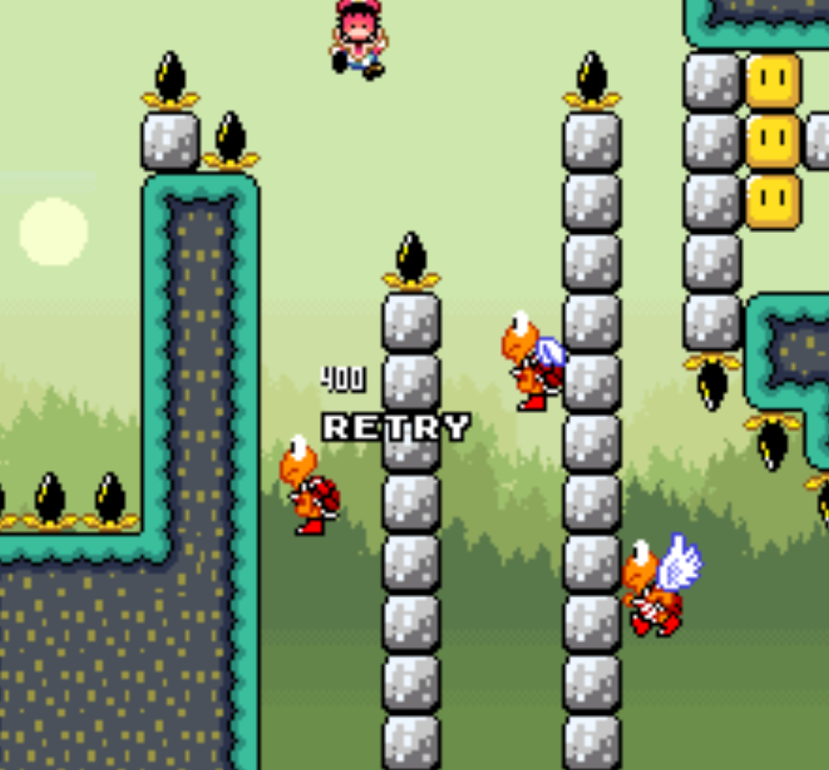

 **This is super clever.  This provides a nice time challenge for speed runners but it's not super tight or anything for regular players.  Also good call on the top muncher to provide a way to break a soft lock.**
 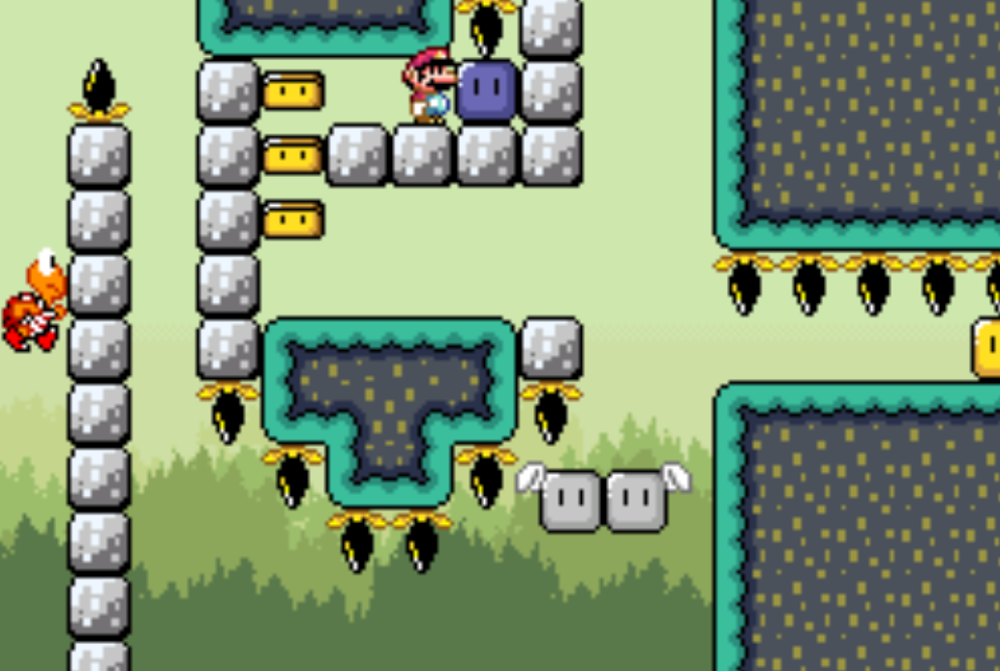

 **LMAO Gottem.  I feel like I should have expected this Kaizo block as the level totally calms down in this section.  Super fair Kaizo block IMO.**
 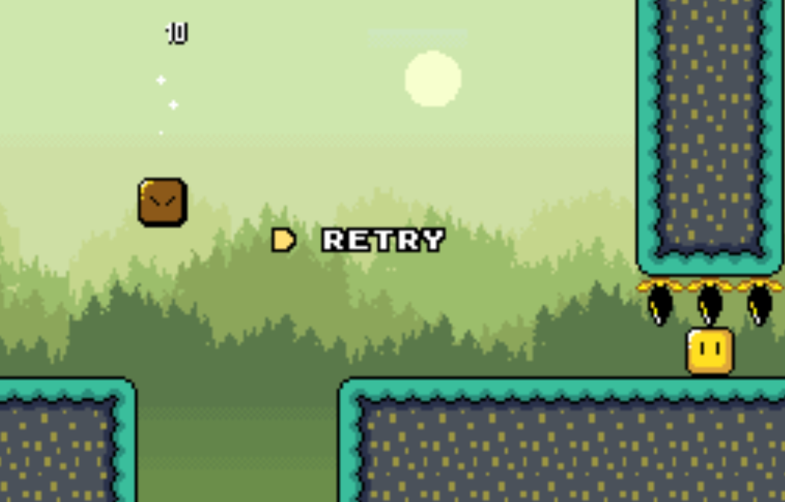

 **At first I thought this trick was super difficult, but then realizing it's a controlled jump it was quite a bit easier, and I could replicate it no issues. I also noticed the plant's fire doesn't always spawn. Weird. Probably depends on where my camera is.**
 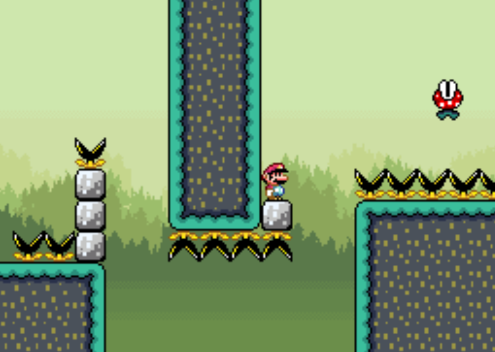

 **So this trick fits right into Invictus-Level difficulty, but wow I found this tough.  First of all, I'm holding X and A for a spin-jump off of the spinys, and I have to swap my fingers down to a regular jump off of the fast-moving platform, followed by a tight controlled jump that requires quite a bit of momentum to reach the 2nd goomba. Oof.  The shell-jump isn't bad as long as I'm not flustered by the time I get there - which yeah, I totally am.**
 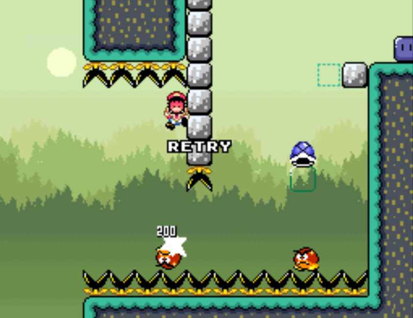

 **This coin might be slightly off? For me, the best jump was slightly before I was able to collect the coin, instead of getting it. If I got it, I had a chance of missing the 2nd flying Koopa, which messed up the falling-platform timing. I wonder if moving it up the ramp by 1 block would end up being too close though.**
  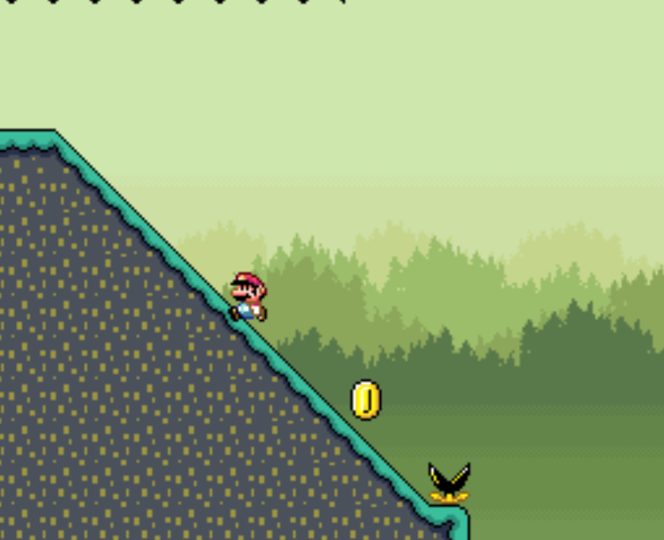

 **Nice bit of swaggy in the end here.  At first I wanted to question the need for the indicator, but after trying to find the right spot to toss up the block I realized the answer was right in front of me.  Well played.**
 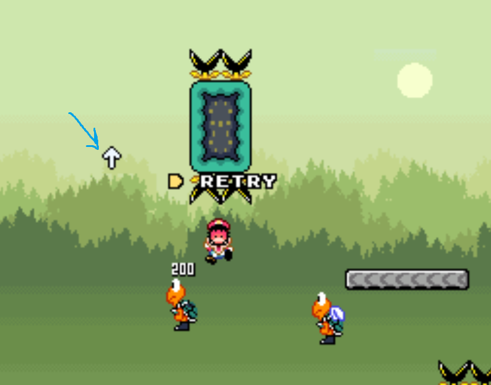

 **DUDE 10/10 Ending Troll. Brilliant, and the pause-timing is going to challenge speed runners to take a decent risk.  Totally brilliant.**
 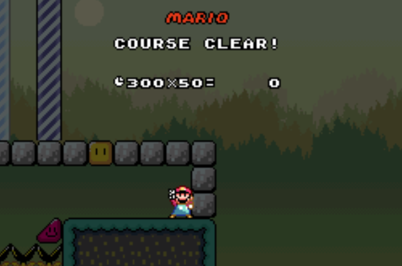